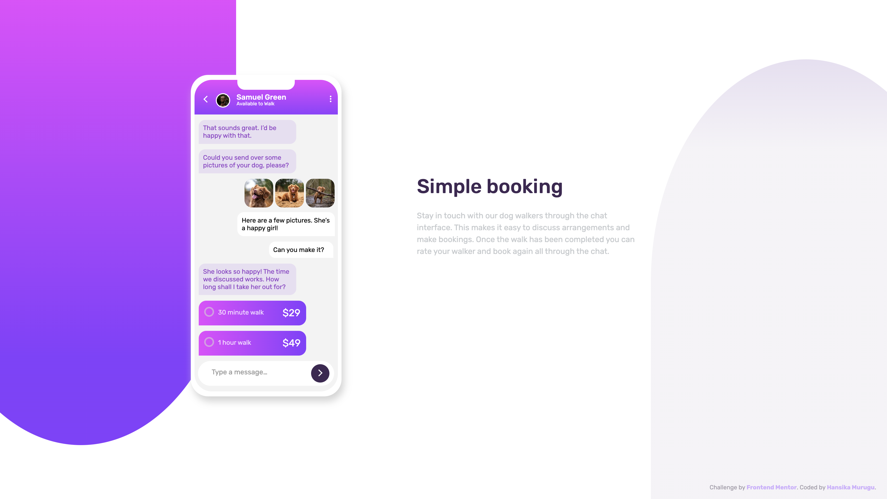

# Chat-App-Preview
<h1 align="center">Chat App Preview</h1>

  <h3>
    <a href="hmurugu.github.io/chat-app-preview/" color="white">
      Live
    </a>
  </h3>

   Solution for a challenge from  <a href="https://www.frontendmentor.io/" target="_blank">frontendmentor.io</a>.

 
 
 

## Table of contents

- [Overview](#overview)
- [Built with](#built-with)
- [Additions](#Additions)

### Overview

The challenge is to build out QR code component and get it looking as close to the design as possible.

### Built with

- HTML
- CSS

###Additions
I've also added a PHP component for the contact me page, apart from the Front End challenge itself.

 hmurugu 2022 

